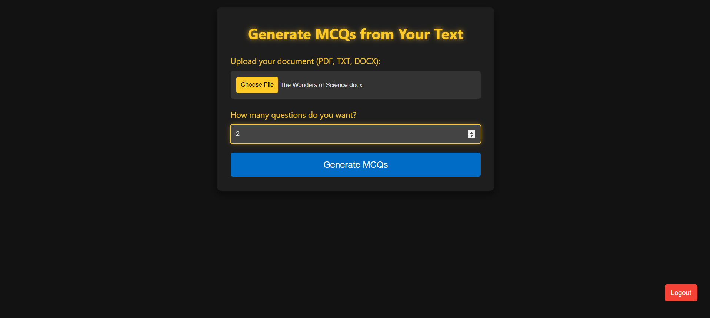
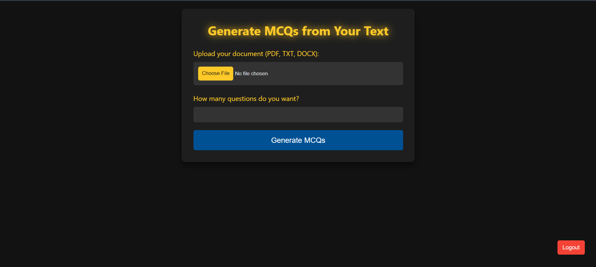

# MCQ Generator

**MCQ Generator** is a web-based tool designed to help users generate Multiple Choice Questions (MCQs) from text files effortlessly. The tool provides easy upload, automated question generation, and a simple login system with Google and email authentication.

## Features

- **Automated MCQ Generation**: Upload text files and automatically generate MCQs from your content.
- **Firebase Authentication**: Secure user authentication using Google Sign-In or email/password login.
- **User-friendly Interface**: Intuitive and minimalistic design for easy navigation and quick access to functionalities.
- **Responsive Design**: Fully functional on various screen sizes and devices.
- **Frontend Only**: No backend required as Firebase handles all storage and authentication.

## Demo



## Technology Stack

- **Frontend**: HTML, CSS, JavaScript
- **Authentication**: Firebase Authentication (Email/Password and Google Sign-In)
- **Firebase Hosting**: For deployment (optional, but recommended)
- **Version Control**: Git, GitHub

## Getting Started

Follow these steps to set up the project locally.

### Prerequisites

Ensure that you have the following tools installed:

- A web browser (Chrome, Firefox, etc.)
- Internet connection to enable Firebase functionality

### Installation

1. **Clone the repository**:

   ```bash
   git clone https://github.com/your-username/mcq-generator.git
   cd mcq-generator
   ```

2. **Firebase Setup**:

   - Create a Firebase project on [Firebase Console](https://console.firebase.google.com/).
   - Enable **Firebase Authentication** with **Email/Password** and **Google Sign-In**.
   - Obtain the Firebase config object from your Firebase project settings.
   - Update the Firebase config object in the `index.html` file under the `<script>` section:

   ```javascript
   const firebaseConfig = {
       apiKey: "YOUR_API_KEY",
       authDomain: "YOUR_AUTH_DOMAIN",
       projectId: "YOUR_PROJECT_ID",
       storageBucket: "YOUR_STORAGE_BUCKET",
       messagingSenderId: "YOUR_MESSAGING_SENDER_ID",
       appId: "YOUR_APP_ID",
       measurementId: "YOUR_MEASUREMENT_ID"
   };
   ```

3. **Run the Application**:

   Open `index.html` in your preferred browser to view the application.

### Usage

1. Log in with either **Google Sign-In** or your registered **Email/Password**.
2. Upload your text file containing the questions.
3. Specify the number of MCQs you'd like to generate.
4. Review and download the generated MCQs.

## Screenshots

### Welcome Page


### Login Page


### MCQ Generator in Action


## Firebase Configuration

You will need to replace the Firebase configuration in the `index.html` file with your own Firebase project details, obtained from the Firebase Console.

```javascript
const firebaseConfig = {
    apiKey: "YOUR_API_KEY",
    authDomain: "YOUR_AUTH_DOMAIN",
    projectId: "YOUR_PROJECT_ID",
    storageBucket: "YOUR_STORAGE_BUCKET",
    messagingSenderId: "YOUR_MESSAGING_SENDER_ID",
    appId: "YOUR_APP_ID",
    measurementId: "YOUR_MEASUREMENT_ID"
};
```

## Future Enhancements

- **MCQ Customization**: Add options to manually edit or delete generated MCQs.
- **Enhanced Question Types**: Expand to other question types, such as True/False, Fill in the Blanks.
- **Analytics Dashboard**: Provide insights and analytics about generated questions.
- **Dark Mode**: Add a dark mode toggle for improved accessibility.

## Contributing

We welcome contributions! Feel free to fork this repository and create a pull request with your improvements.

1. Fork the project.
2. Create a new branch: `git checkout -b feature-branch`.
3. Make your changes and commit them: `git commit -m 'Add new feature'`.
4. Push to the branch: `git push origin feature-branch`.
5. Open a Pull Request.

## License

This project is licensed under the MIT License - see the [LICENSE](LICENSE) file for details.

## Contact

If you have any questions or suggestions, feel free to contact us.

- **Email**: [gurusingh2585@gmail.com](mailto:gurusingh2585@gmail.com)
- **GitHub**: [Your GitHub Profile](https://github.com/your-username)
